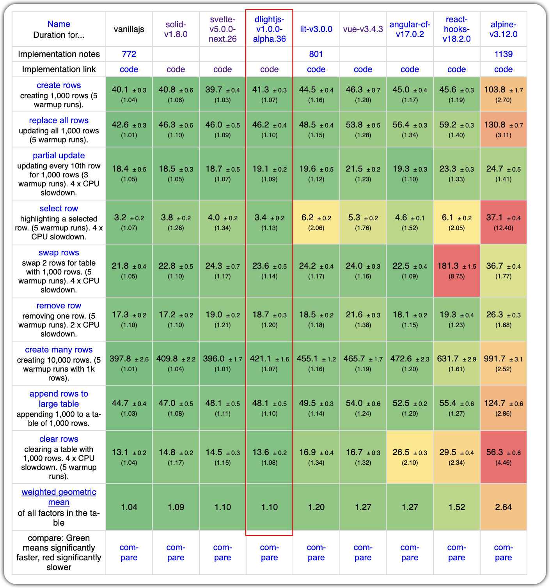
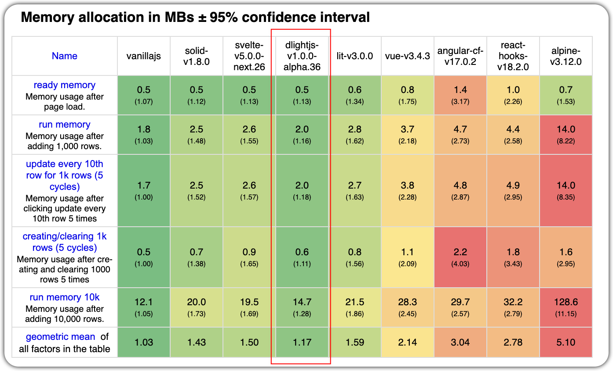
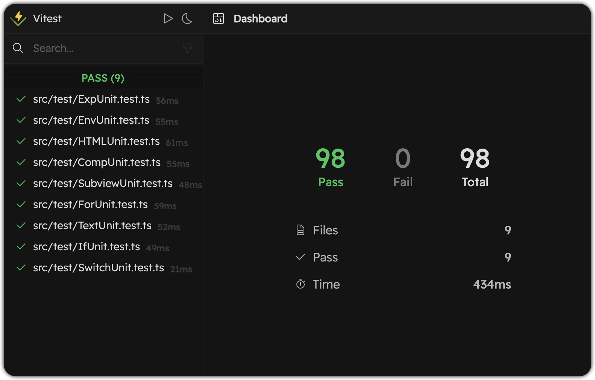
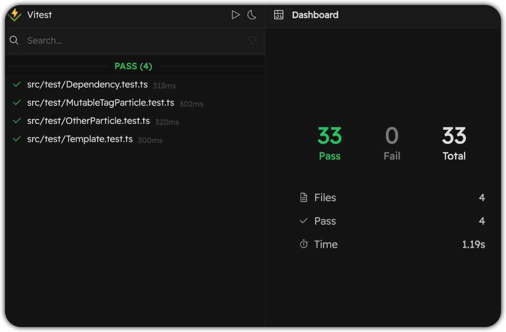

<p align="center">
  
</p>
<p align="center">
  <a href="https://github.com/iandxssxx" target="_black">
    
  </a>
  <a href="https://www.github.com/dlight-js/dlight/stargazers" target="_black">
    
  </a>
  <a href="https://cdn.jsdelivr.net/npm/@dlightjs/dlight"></a>
  <a href="https://www.github.com/dlight-js/dlight/blob/master/LICENSE" target="_black">
    
  </a>
</p>
<p align="center">
  <a href="https://www.npmjs.com/package/@dlightjs/dlight" target="_black">
    
  </a>
  <a href="https://www.npmjs.com/package/@dlightjs/dlight" target="_black">
    
  </a>
  <a href="https://www.npmjs.com/package/babel-preset-dlight" target="_black">
    
  </a>
</p>

# [Traditional Framework Welcome Page](./docs/welcome.md)
# Website - [dlight.dev](https://dlight.dev)


# Cut the shit, real talk
## Another frontend framework?
Sadly yes.

## Show me some code first
I know that you're looking for...
* State
* Computed state
* Component
* Control flow
* ...

```js
import { render, View } from "@dlightjs/dlight"

@View
class Counter {
  count = 0
  doubleCount = this.count * 2

  View() {
    div(this.doubleCount)
    button("+")
      .onClick(() => this.count++)
  }
}

@View 
class WhatsInTheSky {
  @Prop night

  View() {
    if (this.night) {
      "🌘"
      "🌟"
      "✨"
    } else {
      "🔆"
    }
  }
}

@View 
class Fruits {
  fruits = ["🍎", "🍊", "🥑"]

  View() {
    section().id("fruits"); {
      for (const fruit of this.fruits) {
        div(fruit)
      }
    }
  }
}

@View
class App {
  night = true
  toggle() {
    this.night = !this.night
  }

  View() {
    h1(":D")
    div(); {
      Counter()
      Fruits()
      
      button("toggle")
        .onClick(this.toggle)
      WhatsInTheSky()
        .night(this.night)
    }
  }
}

render("app", App)
```

## Performance?
To me the performance is not as important as the DX. But I know you care about it and every framework claims that they're fast, lightweight, and performant. So DLight can't be left behind, right?

So after some dark days of optimization, DLight is now the MOST performant framework.
### Speed
Comparable to solidjs and svelte5. You can count it as one of the fastest data-driven frameworks.


### Memory usage
Most memory efficient data-driven framework.


### Bundle size
All the following sizes are gzipped from the latest version of each framework by [bundlejs](https://bundlejs.com/).
| Framework | Version | Size |
| --- | --- | --- |
| dlightjs | 1.0.0-alpha.63 | 4.41KB |
| preact | 10.19.3 | 4.5KB |
| svelte | 5.0.0-next.30 | 7.02 kB | 
| solidjs | 1.8.9 | 8.36KB |
| vue | 3.4.6 | 38.8 kB |
| react | 17.0.2 | 45.7 kB |
| angular | 12.0.5 | 103 kB |


## Documentation?
Worked my ass on documentations. Check [Documentation](https://dlight.dev/docs/getting-started)

And there're a set of examples to walk you through DLight: [Example](https://dlight.dev/examples/introduction/hello-world)

## Testing?
100% branch coverage for dlight syntax parser:



Still working on view manipulating tests. Tedious work...

## Anyone using it built something?
[DLight's website](https://dlight.dev/) including a [code playground](https://dlight.dev/playground) was fully developed in DLight.js, and the source code's [here](https://github.com/dlight-js/homepage). Credits to [Xinyi](https://github.com/orange04).

## Why another fucking framework in 2024?
### Please, no more functional components. 
I have plenty of reasons to favor class components over functional components in a **signal-based MVVM** framework(Don't jump on me so fast. It's for signal-based and MVVM frameworks, not immutable).

#### 1. What does an MVVM framework need?

We've been using functional components for years, starting from React 16.8.
But is that really a good idea for a signal-based MVVM framework?

Let's consider the following pseudo code:
```js
function MyComp() {
  let count = 0
  effect(() => {
    console.log(count)
  })

  return <div>{count}</div>
}
```

So
1. why are we mixing the view and data together since it only runs once and the view is always the returned value? Might templated frameworks or Angular offer a more structured approach?
2. How does data flow through this component? With count affecting both effect and the view, why must we adhere to a linear declaration order? This is a byproduct of the functional approach, where execution flows from top to bottom. However, in an MVVM context, data and views are interconnected in a more flexible, non-linear manner. Vue2 is a good example of this but the syntax is bad so they moved to functional components in Vue3. Angular is still in the game, good for them.
So you can't do this in a functional component:
```js
function MyComp() {
  View: <div>{count}</div>
  effect(() => {
    console.log(count)
  })
  let count = 0
}
```
But you can in a class component:
```js
class MyComp {
  View = <div>{count}</div>
  effect() {
    console.log(this.count)
  }
  count = 0
}
```
Makes more sense since the data and view are constructed and connected like a graph instead of a straight line.

In React, the paradigm of `View = fn(data, state)` fits perfectly with functional components. However, in other signal-based frameworks, a more reasonable paradigm would be `signal1 -> View` + `signal2 -> View` + `signal1 -> Observer` instead of a uni-directed flow of `signal1 -> signal2 -> Observer -> View`.

#### 2. Signal, signal, signal
2023 is the year of signals. Signal is just a fancy word for getter + setter. 

How can we get create a signal? 
1. Create a getter and setter
```js
const [getCount, setCount] = signal(0)
<div>{getCount()}</div>
```
2. Wrap it in an object
```js
const count = signal(0)
<div>{count.value}</div>
```

But guess who can have a getter and setter from the beginning? Class property!
```js
class MyComp {
  count = 0
   
  View() {
    <div>{this.count}</div>
  }
}
```
So we can use our compiler to transform class properties into signals, straightforward and much more statically analyzing room for a finer grained reactivity system and a more efficient updating strategy:
```js
class MyComp {
  _count = 0
  get count() {
    return this._count
  }
  set count(val) {
    if (val === this._count) return
    this._count = val
    updateViewThatDependsOnCount()
  }
   
  View() {
    <div>{this.count}</div>
  }
}
```


### Bye-bye, JSX
XML is a language for 90s machines, not for humans. Apart from the extra closing tags, in JSX you can't even use for loops or if statements. A typical question: how can we write a conditional rendering with short-circuit evaluation in JSX?
```js
if (condition === "a") {
  <div>hello</div>
} else if (condition === "b") {
  <div>world</div>
} else if (condition === "c") {
  <div>!</div>
}
```

Like this?
```js
{condition === "a" && <div>hello</div>}
{condition !== "a" && condition2 === "b" && <div>world</div>}
{condition !== "a" && condition2 !== "b" && condition3 === "c" && <div>!</div>}
```
No it did not early exit. The condition is evaluated 3 times in this example. Even if you don't care about the performance, the code is still unreadable.

All you can do is to bury yourself with this:
```js
{(() => {
  if (condition === "a") {
    return <div>hello</div>
  } else if (condition === "b") {
    return <div>world</div>
  } else if (condition === "c") {
    return <div>!</div>
  }
})()}
```
I know a lot of frameworks are trying to solve this problem, but they're all just workarounds. We need to solve the problem from the root.

If we're going to drop JSX, we have to come up with some way better syntax to build UI. Not just some mediocre template engine that gives you a headache when you try to do something more complex. We want PURE JAVASCRIPT POWER.

Let's get some inspiration from SwiftUI.
SwiftUI is beautiful(in ui building syntax part):
```swift
struct ContentView: View {
  var body: some View {
    VStack {
      Text("Hello, world!")
        .padding()
      Text("Hello, world!")
        .padding()
      Text("Hello, world!")
        .padding()
    }
  }
}
```
Swift has this closure syntax that makes it possible to build a tree-like structure. But in JavaScript, we don't have that, can we mimic one?

We can have a good taste of function call syntax like this:
```js
div(
  h1("hello"),
  p("world")
)
```

But it's still treating the children as a list of arguments, which inevitably leads to those annoying tailing commas. Also there'll be no room for attributes expect for we put is as an object pattern in the first argument, which is not a good idea.

Since we're using a compiler, let's think big. Who can have a `{}` syntax? Block statements! So what if we treat each block statement as the previous element's children? Then we can have a more flexible tree-like structure and use function dot chaining to set attributes just like SwiftUI:

```js
div()
{
  h1("hello")
  p("world")
}
```

And you can inline the children with the parent element by adding a ";" to split them:
```js
div(); {
  h1("hello")
  p("world")
}
```

A more complex real world comparison between JSX and DLight with control flow:
```js
Wrapper()
  .id("wrapper")
  .class("wrapper")
{
  CustomHeader("My Custom Header")
    .description("This is a custom header component")
    .color(color)
    .backgroundColor(bgColor)
  for (const { id, name, type } of items) {
    key: id
    if (type === "normal") {
      NormalItem(name)
    } else {
      SpecialItemWrapper(); {
        SpecialItem(name)
      }
    }
  }
  CustomFooter("My Custom Footer")
}
```
```js
<Wrapper
  id="wrapper"
  class="wrapper"
>
  <CustomHeader 
    title="My Custom Header" 
    description="This is a custom header component"
    color={color}
    backgroundColor={bgColor}
  />
  {items.map(({ id, name, type }) => (
    type === "normal" 
      ? <NormalItem key={id} name={name} />
      : (
        <SpecialItemWrapper key={id}>
          <SpecialItem name={name} />
        </SpecialItemWrapper>
      )
  ))}
  <CustomFooter content="My Custom Footer" />
</Wrapper>
```

I'm not cherry-picking here. This is how real world jsx code looks like.

I won't say this new syntax kills JSX, but it's definitely a good alternative for us who want to write pure JavaScript code, and DLight doesn't introduce any new syntax, just the old fellows you know in js. (And we know if you're a jsx fan, you'll never be convinced by this, ~~so just go away~~ so we extracted the dlight syntax parser into a standalone package, you can write your own jsx parser to override dlight parser and be injected in reactivity-parser to get all the cool features that dlight offers. If you're interested in this, feel free to start a discussion and we'll help you out.)

## What DLight is offering
Copy-pasting an existing framework and changing a little bit of syntax or make it 0.01x faster is just adding another pile of x in the 5-new-frameworks-per-day(or even more) frontend world.

Coding out a framework is fairly simple. What's hard is to avoid the fixed mindset of existing frameworks, re-examine the essence of frontend frameworks, and create a better frontend development experience. It's all about the design.

So DLight is offering all the features we've talked about above:
1. Fast
2. Lightweight
3. Memory efficient
4. Intuitive
5. Well designed
6. Well tested
7. Well documented
8. Class components for signals
9. Whole new syntax with old buddies in js

and more:

10. Easiest reactivity system ever  
```js
// No more
const [count, setCount] = useState(0)
// Or
const [getCount, setCount] = createSignal(0)
console.log(getCount())
// Or
const count = ref(0)
console.log(count.value)
// Or
const count = 0
$: doubleCount = count * 2
// ....
// Just use class properties to set any (derived) state you want
class {
  count = 0
  doubleCount = this.count * 2
  anyMethod() {
    console.log(this.doubleCount)
  }
}
```
11. Real lifecycle: `willMount`, `didMount`, `didUpdate`, `willUnmount`, `didUnmount`
12. A whole new way to think about context, i.e, [environment variables](https://dlight.dev/docs/basic-usages/environment-variables) in DLight.
13. Seamlessly integrate with existing frontend tech chain like [styling](https://dlight.dev/docs/basic-usages/best-practices)
14. Great [TypeScript support](https://dlight.dev/docs/typescript-support) 

## Will there be SSR?
Yes if there're a fair amount of people interested in this project. I don't want to just do a simple hydration solution only to improve SEO. Currently I've implemented a minimal SSR solution that goes with a component-level island strategy with auto server/client component type detection. If you're interested in this, create an issue.

## What's the next step?
1. Testing and debugging for v1.0.0 statable release
2. Fill the documentation
3. Write articles about the design of DLight
4. Make some tutorials(video and text) for DLight
5. SSR

If you want to contribute to DLight, we're more than happy to have you on board. It's never a one man's job to build a full-fledged framework. Any kind of contribution is welcome, from documentation to code or even criticism. Join the [discord server](https://discord.gg/TZQxTA5G) to spit out your ideas.

# Credits
Thanks all existing frameworks for the inspiration and the great work they've done. DLight is standing on the shoulders of giants.
* [SwiftUI](https://developer.apple.com/xcode/swiftui/)
* [React](https://react.dev/)
* [Vue](https://vuejs.org/)
* [Svelte](https://svelte.dev/)
* [Solid](https://solidjs.com/)
* [Angular](https://angular.dev/)
* [Qwik](https://qwik.builder.io/)
* [Ember](https://emberjs.com/)
* [Marko](https://markojs.com/)
* [VanJs](https://vanjs.org/)
* [ef.js](https://ef.js.org/)

Thanks for [js-framework-benchmark](https://github.com/krausest/js-framework-benchmark) for the benchmarking tooling that pulls my hair out.


# Contributors
<!-- ALL-CONTRIBUTORS-LIST:START - Do not remove or modify this section -->
<!-- prettier-ignore-start -->
<!-- markdownlint-disable -->
<table>
  <tbody>
    <tr>
      <td align="center" valign="top" width="14.28%"><a href="https://github.com/IanDxSSXX"><br /><sub><b>Duan Yihan</b></sub></a><br /><a href="#infra-IanDxSSXX" title="Infrastructure (Hosting, Build-Tools, etc)">🚇</a> <a href="https://github.com/dlight-js/dlight/commits?author=IanDxSSXX" title="Tests">⚠️</a> <a href="https://github.com/dlight-js/dlight/commits?author=IanDxSSXX" title="Code">💻</a></td>
      <td align="center" valign="top" width="14.28%"><a href="https://github.com/orange04"><br /><sub><b>Chen Xinyi</b></sub></a><br /><a href="https://github.com/dlight-js/dlight/commits?author=orange04" title="Code">💻</a> <a href="#design-orange04" title="Design">🎨</a></td>
      <td align="center" valign="top" width="14.28%"><a href="https://github.com/Guo-lab"><br /><sub><b>Guo Siqi</b></sub></a><br /><a href="#content-Guo-lab" title="Content">🖋</a></td>
    </tr>
  </tbody>
</table>

<!-- markdownlint-restore -->
<!-- prettier-ignore-end -->

<!-- ALL-CONTRIBUTORS-LIST:END -->
<!-- prettier-ignore-start -->
<!-- markdownlint-disable -->

<!-- markdownlint-restore -->
<!-- prettier-ignore-end -->

<!-- ALL-CONTRIBUTORS-LIST:END -->
